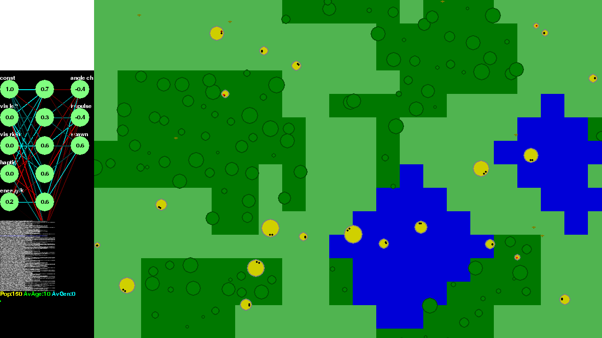

Novel Evolve
============

An evolution simulator featuring neural networks and the occasional orange.

Background
----------

In 2015, for [NaNoGenMo](https://github.com/flexo/nanogenmo2015), I made randomly-generated characters fight to the death on a map for the sake of writing interesting diary entries. They weren't very good at either of those things.

After falling down a YouTube rabbit hole one day, I came across various evolution simulators and then [one that also used neural networks](https://www.youtube.com/watch?v=C9tWr1WUTuI) for its creatures. This sounded promising! So I tapped away at my keyboard until some things appeared on the screen with the aim of plugging in or reimplementing parts of my novel generator.

Latest screenshot
-----------------



Running the simulator
---------------------

This is still a work in progress and this may change, but roughly:

```bash
$ pip install pygame # or apt-get install python-pygame on Debian-based distros
$ git clone https://github.com/flexo/novel-evolve.git
$ cd novel-evolve
$ python novel-evolve
```

